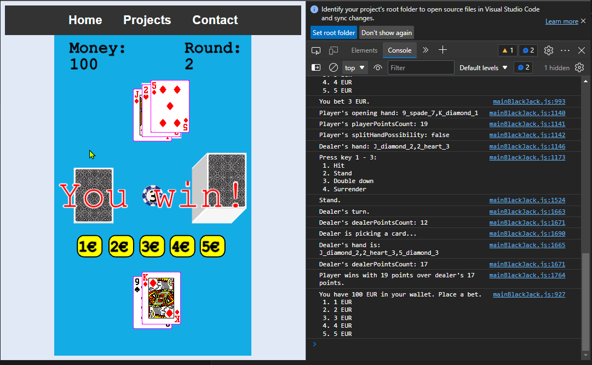

# About
I started to learn programming in 2018-2019 and this used to be my "portfolio web site" :snowflake: Originaly it was hosted on 000webhost but it is long time gone so here you are -> rehosted at GitHub Pages!

## Pages

  
Home

   
Direct link to [Home](https://duckduckgo.com) page.

There are share buttons at the bottom. The APIs probably changed since then, I haven't checked, I don't use social media anymore.

  
The Poop Tracker

   
Direct link to [The Poop Tracker](https://duckduckgo.com) page.

My very first line of code was written on Raspberry Pi in Python. It was infinite loop receiving signals from my cat's toilet and sending it to SQL database on 000webhost. Every time you loaded The Poop Tracker, it queried last 10 rows of the table. Of course that part is not there.

Also I was not familiar with Bootstrap or similar frameworks, so I created my own vanilla image preview thing.

  
Cats versus Robots!

   
Direct link to [Cats versus Robots!](https://duckduckgo.com) page.

My first 2D game with sprites. Fully responsive, with buttons if you want to play on a cell phone.

  
Blackjack

   
Direct link to [Blackjack](https://duckduckgo.com) page.

If you play this long enough, you will find bugs.

Feature: you can play this using keyboard in the Console!

  
Flappy Cat (Playable)

   
Direct link to [Flappy Cat (Playable)](https://duckduckgo.com) page.

This is flappy bird 2D game recreated based on videos from my Javascript guru [Daniel Shiffman](https://twitter.com/shiffman). Check his channel on [Youtube](https://www.youtube.com/channel/UCvjgXvBlbQiydffZU7m1_aw). 

  
Flappy Cat (with Tensorflow.js)

   
Direct link to [Flappy Cat (with Tensorflow.js)](https://duckduckgo.com) page.

This is the same as before but using TensorFlowJS. 

Tutorial how to build this is in this Coding Train's [neuroevolution](https://www.youtube.com/watch?v=lu5ul7z4icQ&list=PLRqwX-V7Uu6Yd3975YwxrR0x40XGJ_KGO) playlist.

 

## Disclaimer
Code contains lot of high quality spagetti code, the only code which I was capable of writing at that time.

